# 🛒 Matger - E-Commerce RESTful API

A production-style E-Commerce RESTful API built with **ASP.NET Core .NET 9** following **Onion Architecture** and modern backend development practices.

The API allows customers to browse products, search and filter items, manage shopping baskets, authenticate securely, create orders, and complete online payments using Stripe.

---

# Features

- Product Management
- Product Search
- Product Filtering
- Product Sorting
- Pagination
- Shopping Basket
- JWT Authentication
- User Registration & Login
- ASP.NET Core Identity
- Address Management
- Order Management
- Payment Integration (Stripe)
- Redis Basket Storage
- Global Exception Handling
- Data Seeding
- Swagger Documentation

---

# Technologies

- ASP.NET Core .NET 9
- C#
- SQL Server
- Entity Framework Core
- LINQ
- ASP.NET Core Identity
- JWT Authentication
- Redis
- Stripe Payment Gateway
- AutoMapper
- Swagger / OpenAPI
- Postman

---

# Design Patterns

- Onion Architecture
- Repository Pattern
- Unit of Work Pattern
- Specification Pattern
- Dependency Injection

---

# Solution Structure

<p align="center">

</p>

---

# Swagger Documentation

## API Overview

<p align="center">
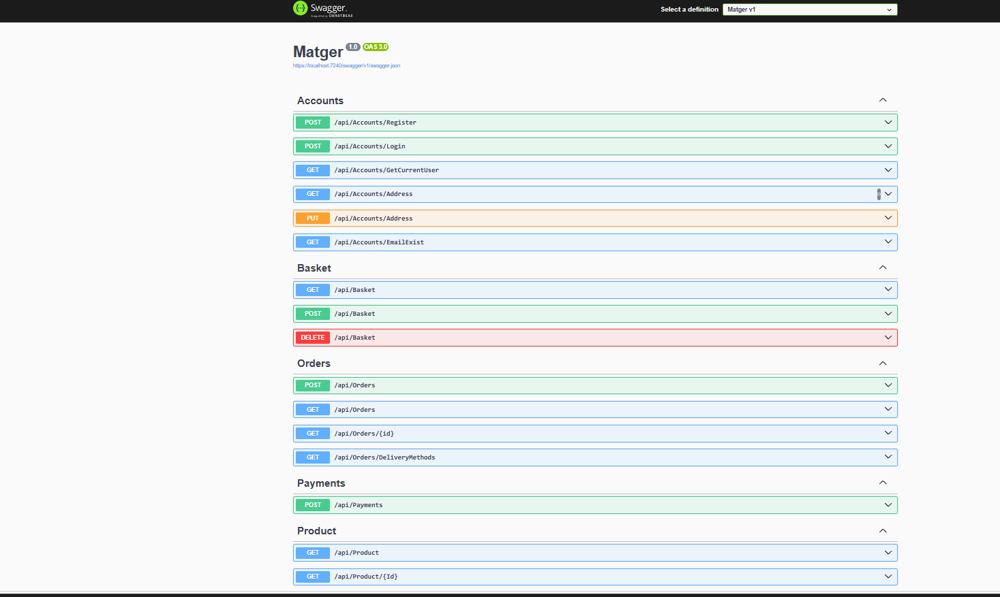
</p>

## Products

<p align="center">
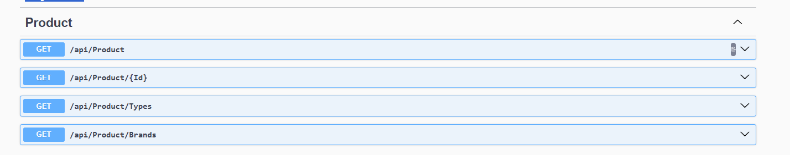
</p>

## Accounts

<p align="center">
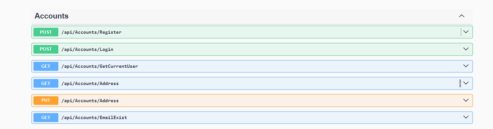
</p>

## Basket

<p align="center">
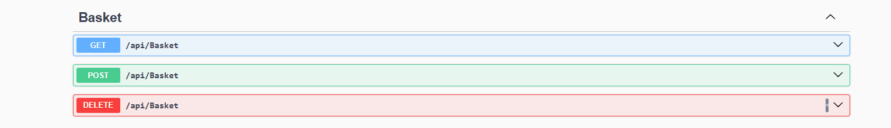
</p>

## Orders

<p align="center">
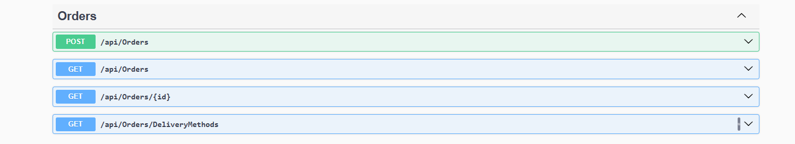
</p>

## Payments

<p align="center">

</p>

---

# Postman Testing

## Authentication

<p align="center">
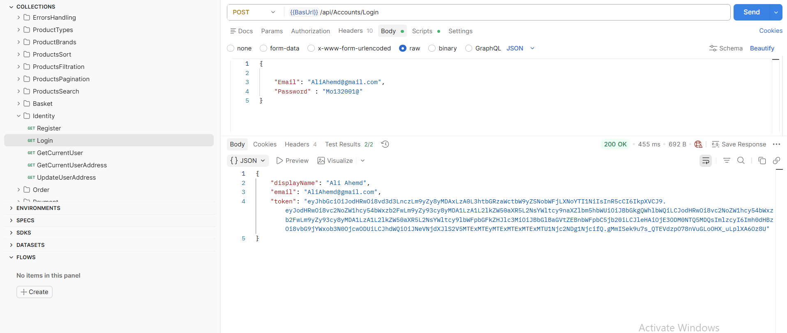
</p>

## Products

<p align="center">
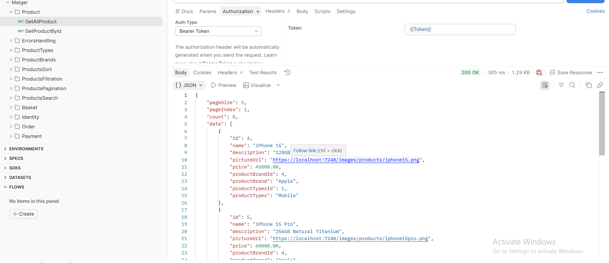
</p>

## Product Search

<p align="center">
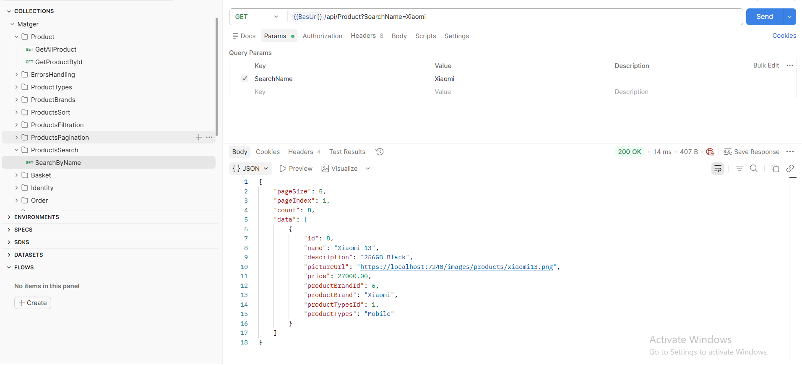
</p>

## Product Filtering

<p align="center">
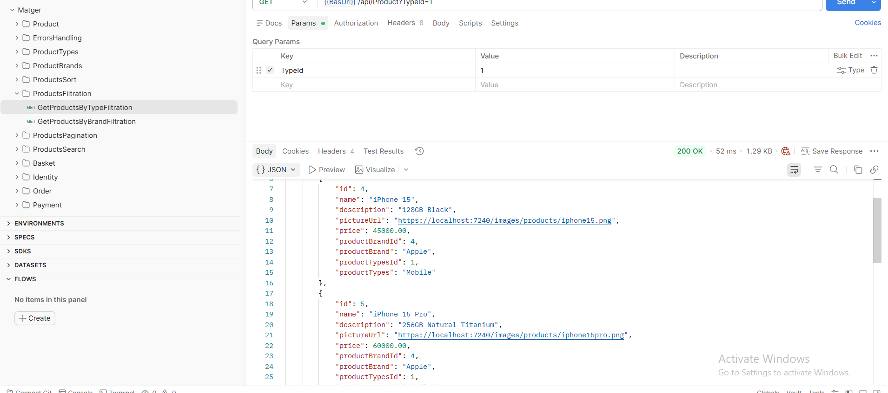
</p>

## Product Sorting

<p align="center">
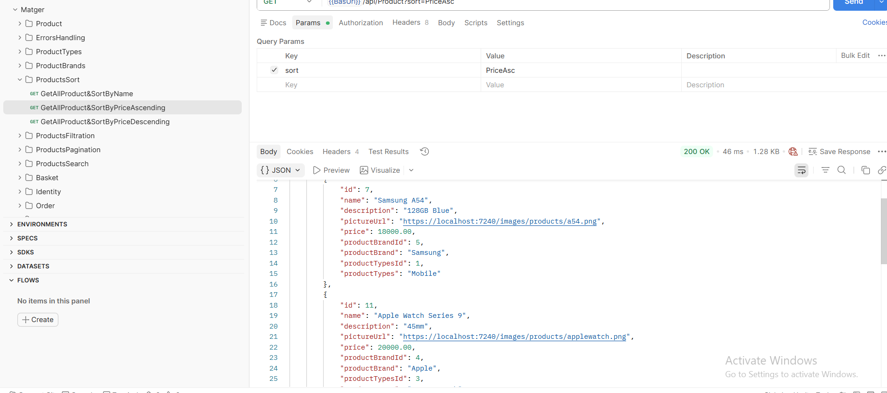
</p>

## Product Pagination

<p align="center">
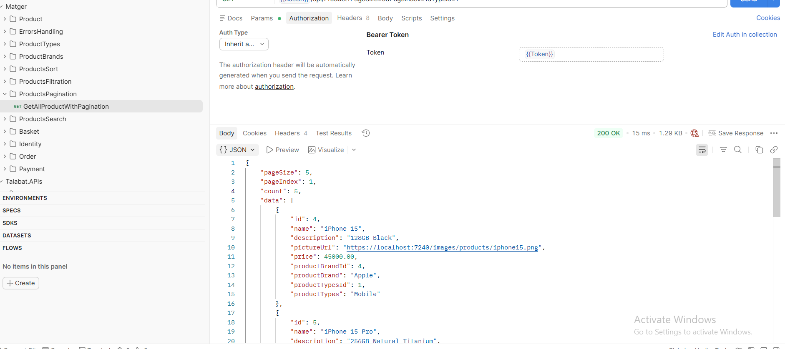
</p>

## Product Brands

<p align="center">
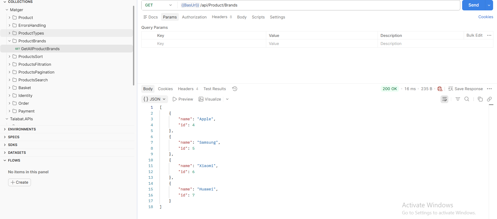
</p>

## Product Types

<p align="center">
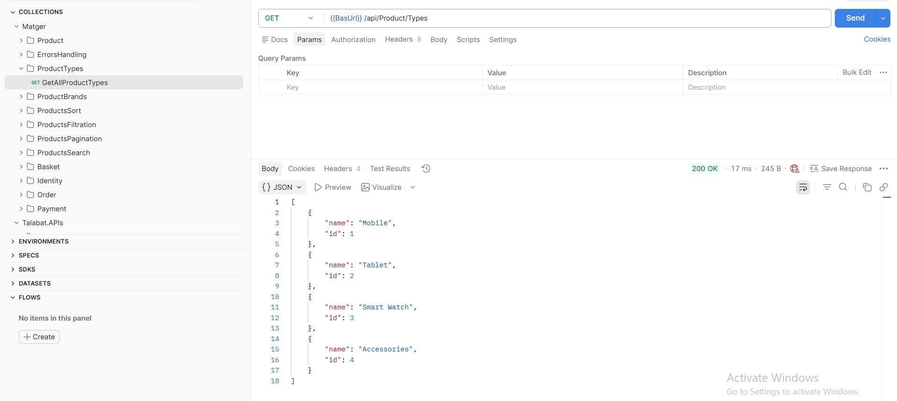
</p>

## Basket

<p align="center">
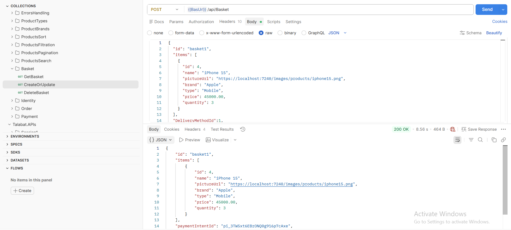
</p>

## Orders

<p align="center">
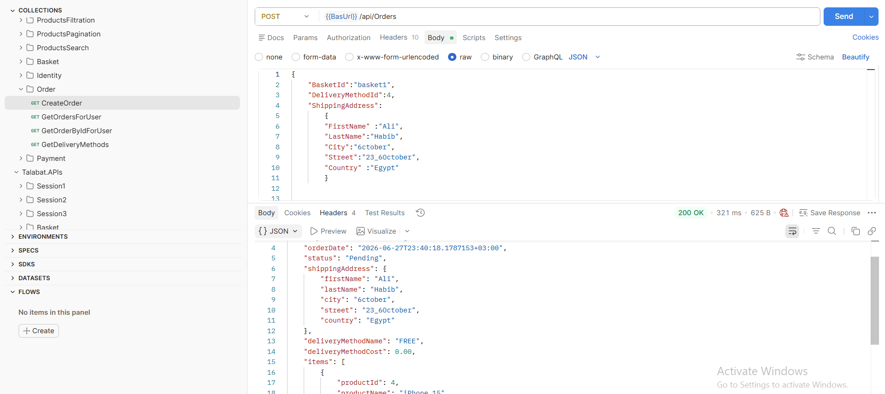
</p>

## Payments

<p align="center">
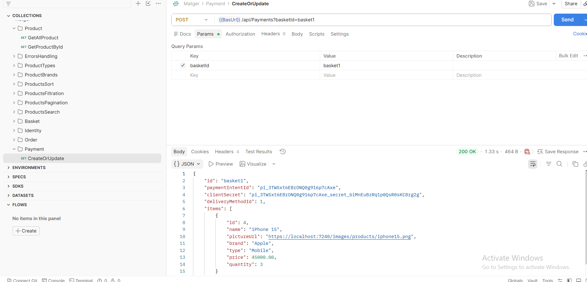
</p>

## Error Handling

<p align="center">
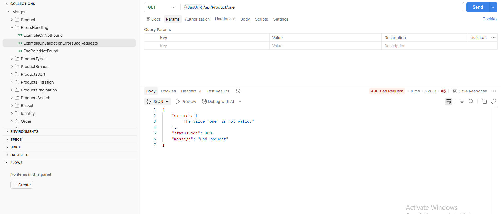
</p>

---

# Database

## ER Diagram

<p align="center">
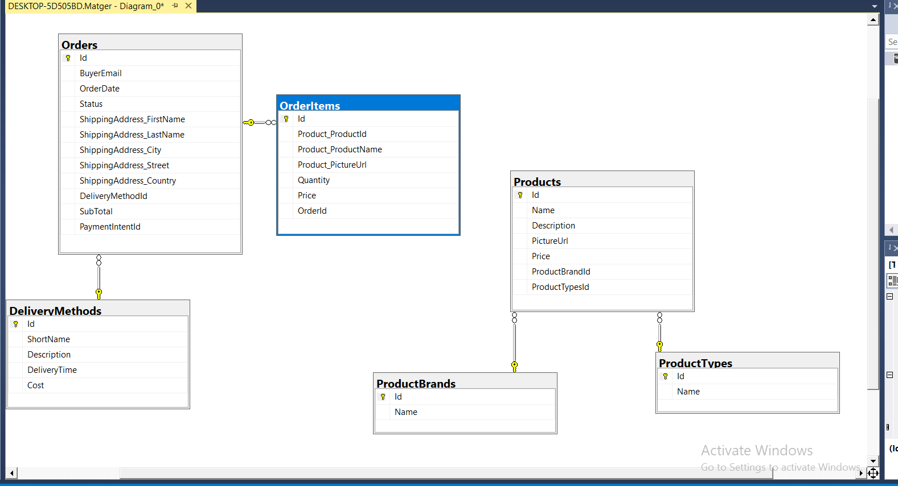
</p>

## Application Tables

<p align="center">
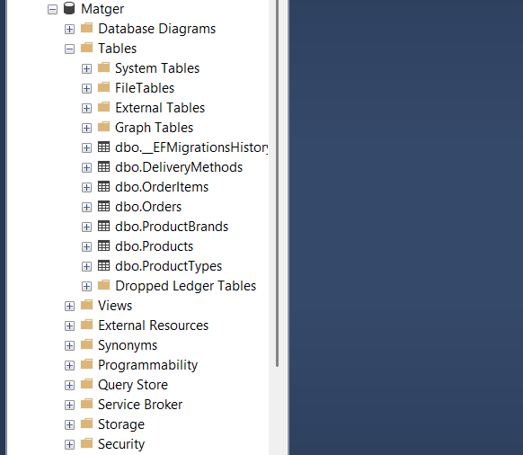
</p>

## Identity Tables

<p align="center">

</p>

---

# Redis

<p align="center">
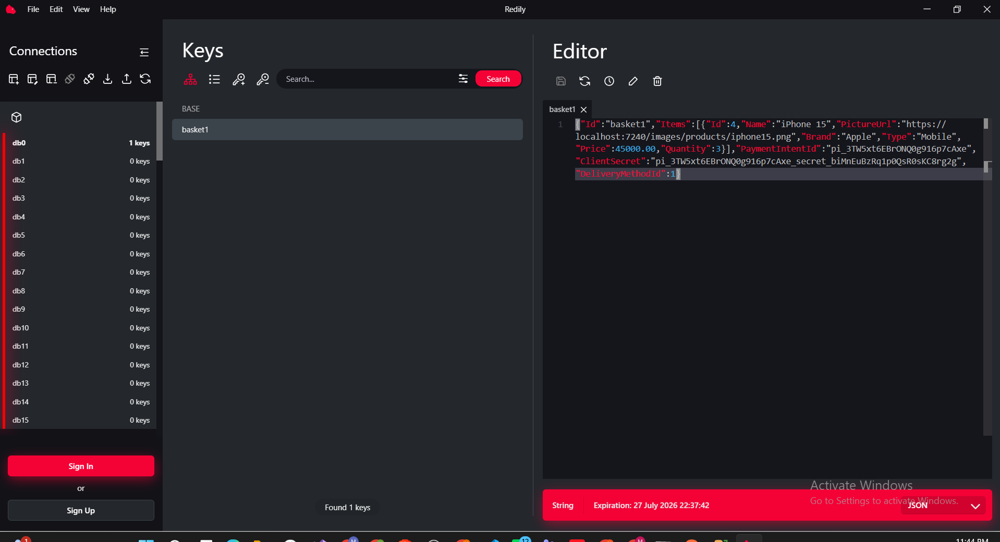
</p>

Redis is used to store customer shopping baskets, providing fast data access and improving application performance.

---

# API Modules

- Products
- Product Brands
- Product Types
- Basket
- Accounts
- Orders
- Payments

---

# Getting Started

```bash
git clone https://github.com/mohamedhabibb/Matger.git
```

```bash
cd Matger
```

Update your **appsettings.json** with:

- SQL Server Connection String
- JWT Settings
- Stripe Secret Key
- Redis Connection

Run:

```bash
dotnet restore
```

```bash
dotnet ef database update
```

```bash
dotnet run
```

Open Swagger:

```
https://localhost:xxxx/swagger
```

---

# Project Highlights

✔ Onion Architecture

✔ Repository Pattern

✔ Unit of Work

✔ Specification Pattern

✔ JWT Authentication

✔ ASP.NET Core Identity

✔ Stripe Payment Integration

✔ Redis Caching

✔ SQL Server

✔ Entity Framework Core

✔ Swagger Documentation

✔ Postman Collection

✔ Production-style REST API

---

# Author

**Mohamed Abdelnasser**

Backend .NET Developer
